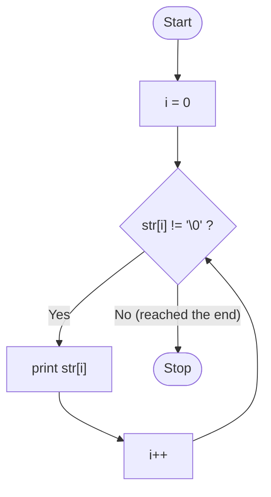
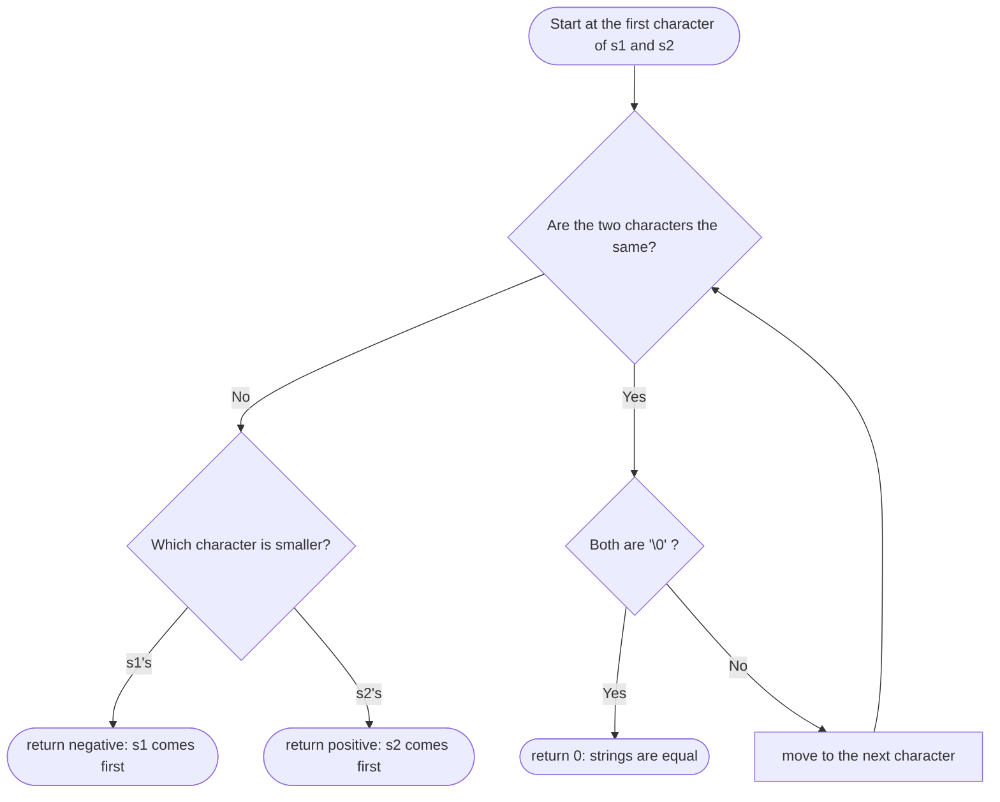
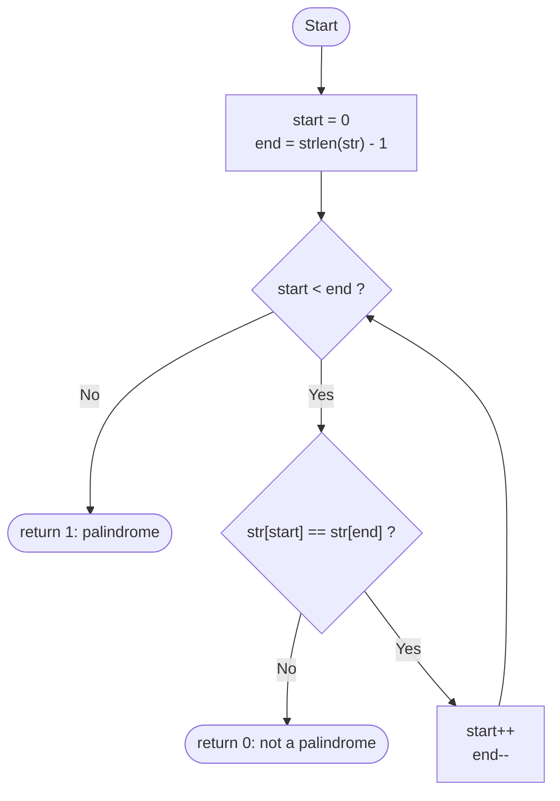

# Chapter 15 — Lecture: Strings

## 📖 Reference: *Let Us C*, 19th Edition — Chapter 15: "Strings"

---

## 15.1 What are Strings?

A **string** in C is simply an array of `char` elements, terminated by a special **null character** `'\0'` (ASCII value 0), which marks the end of the actual text content.

```c
char name[6] = {'A', 'y', 'a', 'n', '\0'};   /* explicit array form */
char name2[6] = "Ayan";                       /* shorthand string-literal form -- '\0' added automatically */
```

> A string of `n` visible characters requires an array of **at least `n + 1`** elements — the extra slot is for the mandatory `'\0'` terminator. Forgetting this is a very common sizing bug.

```c
char greeting[] = "Hello";   /* size automatically inferred as 6: 'H','e','l','l','o','\0' */
```

**Picture it in memory:**

```
greeting
  ┌─────┬─────┬─────┬─────┬─────┬─────┐
  │ 'H' │ 'e' │ 'l' │ 'l' │ 'o' │ '\0'│
  └─────┴─────┴─────┴─────┴─────┴─────┘
index:  0     1     2     3     4     5
                                   ▲
           5 visible characters    └── the end marker (6th slot)
```

## 15.2 More About Strings

### Reading Strings

```c
#include <stdio.h>
int main()
{
    char name[50];

    printf("Enter your name: ");
    scanf("%s", name);         /* NOTE: no '&' needed -- 'name' already decays to an address */

    printf("Hello, %s!\n", name);
    return 0;
}
```

> **`scanf("%s", ...)` stops reading at the first whitespace character** — so it cannot read a name with a space in it (e.g., "John Smith") in one go. To read an entire line, including spaces, use `fgets()`:

```c
char line[100];
printf("Enter a full sentence: ");
fgets(line, sizeof(line), stdin);   /* reads up to sizeof(line)-1 chars, or until '\n', whichever comes first */
```

> `fgets()` also captures the trailing newline character (`'\n'`) as part of the string, if there is room — this often needs to be manually stripped for further processing.

### Printing Strings

```c
printf("%s\n", name);   /* prints characters up to (but not including) the '\0' terminator */
```

### Traversing a String Manually

```c
#include <stdio.h>
int main()
{
    char str[] = "Hello";
    int i = 0;

    while (str[i] != '\0')
    {
        printf("%c", str[i]);
        i++;
    }
    printf("\n");
    return 0;
}
```

**Flow of the loop:**



This idiom — looping `while (str[i] != '\0')` — is the fundamental building block for nearly every manual string-processing algorithm in C.

## 15.3 Pointers and Strings

A string literal or `char` array, just like any array, **decays to a pointer** to its first character:

```c
char str[] = "World";
char *p = str;         /* p points to 'W' */

printf("%c\n", *p);    /* prints 'W' */
printf("%s\n", p);     /* printf's %s follows the pointer until '\0' -- prints "World" */
```

You can also traverse a string entirely through a pointer, without indexing:

```c
char str[] = "Hi!";
char *p = str;

while (*p != '\0')
{
    printf("%c", *p);
    p++;
}
printf("\n");
```

**How `p` moves through the string:**

```
          ┌─────┬─────┬─────┬─────┐
   str →  │ 'H' │ 'i' │ '!' │ '\0'│
          └─────┴─────┴─────┴─────┘
             ▲     ▲     ▲     ▲
   step 1:   p     │     │     │     *p is 'H' → print, p++
   step 2:         p     │     │     *p is 'i' → print, p++
   step 3:               p     │     *p is '!' → print, p++
   step 4:                     p     *p is '\0' → loop stops
```

## 15.4 Standard Library String Functions (`<string.h>`)

Manually re-implementing string operations is instructive, but real programs almost always use the **standard library** for correctness and efficiency:

| Function | Purpose | Example |
|---|---|---|
| `strlen(s)` | Returns the length of `s` (excluding `'\0'`) | `strlen("Hi")` → `2` |
| `strcpy(dest, src)` | Copies `src` into `dest` (including `'\0'`) | `strcpy(buf, "Hello")` |
| `strcat(dest, src)` | Appends `src` onto the end of `dest` | `strcat(greeting, name)` |
| `strcmp(s1, s2)` | Compares `s1` and `s2` lexicographically | `strcmp("abc","abd")` → negative |

### 15.4.1 `strlen()`

```c
#include <stdio.h>
#include <string.h>
int main()
{
    char str[] = "Programming";
    printf("Length = %zu\n", strlen(str));   /* 11 -- does NOT count the '\0' */
    return 0;
}
```

### 15.4.2 `strcpy()`

```c
char source[] = "Hello";
char dest[20];
strcpy(dest, source);   /* copies "Hello\0" into dest */
```

> **Danger:** `strcpy` performs **no bounds checking** on `dest` — if `dest` is too small for `source`, this causes a **buffer overflow**, a serious and classic security vulnerability. Always ensure `dest` is large enough, or prefer safer alternatives (`strncpy`, or manual bounds-checked copying) in security-sensitive code.

### 15.4.3 `strcat()`

```c
char greeting[50] = "Hello, ";
char name[] = "World!";
strcat(greeting, name);   /* greeting becomes "Hello, World!" */
```

> `dest` in `strcat` must have **enough remaining capacity** to hold both its existing content and the appended string, plus the terminator — again, no automatic bounds checking is performed.

### 15.4.4 `strcmp()`

```c
int result = strcmp("apple", "banana");
/* result < 0 : "apple" comes before "banana" lexicographically ('a' < 'b')
   result == 0 : the strings are identical
   result > 0 : the first string comes after the second */
```

**How `strcmp()` decides (character by character):**



For `strcmp("apple", "banana")`, the very first pair is `'a'` vs `'b'`; they differ and `'a'` is smaller, so the result is negative.

> **Never compare strings with `==`!** `str1 == str2` compares the *pointer addresses*, not the string contents, and will almost always give the wrong (unintended) result. Always use `strcmp(str1, str2) == 0` to test for equality of *content*.

```c
char a[] = "hi";
char b[] = "hi";
if (a == b)          /* WRONG: compares addresses, likely false even though content matches */
    printf("Equal\n");
if (strcmp(a, b) == 0)   /* CORRECT: compares actual characters */
    printf("Equal\n");
```

## 15.5 Worked Programs

### Program 1: Manual String Length (Without `strlen`)

```c
#include <stdio.h>

int myStrlen(char str[])
{
    int length = 0;
    while (str[length] != '\0')
        length++;
    return length;
}

int main()
{
    char str[] = "Bhubaneswar";
    printf("Length = %d\n", myStrlen(str));
    return 0;
}
```

### Program 2: Palindrome String Checker

```c
#include <stdio.h>
#include <string.h>

int isPalindrome(char str[])
{
    int start = 0, end = strlen(str) - 1;
    while (start < end)
    {
        if (str[start] != str[end])
            return 0;
        start++;
        end--;
    }
    return 1;
}

int main()
{
    char str[100];
    printf("Enter a word: ");
    scanf("%s", str);

    if (isPalindrome(str))
        printf("%s is a palindrome.\n", str);
    else
        printf("%s is NOT a palindrome.\n", str);

    return 0;
}
```

**Flow of `isPalindrome()`** — two markers walk towards each other from both ends:



```
"level":   l  e  v  e  l
           ▲           ▲      'l' == 'l'  ✓
              ▲     ▲         'e' == 'e'  ✓
                 ▲            start meets end → palindrome
```

### Program 3: Counting Vowels and Consonants in a String

```c
#include <stdio.h>

int main()
{
    char str[100];
    int i, vowels = 0, consonants = 0;
    char ch;

    printf("Enter a sentence: ");
    fgets(str, sizeof(str), stdin);

    for (i = 0; str[i] != '\0'; i++)
    {
        ch = str[i];
        if ((ch >= 'a' && ch <= 'z') || (ch >= 'A' && ch <= 'Z'))
        {
            if (ch=='a'||ch=='e'||ch=='i'||ch=='o'||ch=='u'||
                ch=='A'||ch=='E'||ch=='I'||ch=='O'||ch=='U')
                vowels++;
            else
                consonants++;
        }
    }

    printf("Vowels     : %d\n", vowels);
    printf("Consonants : %d\n", consonants);

    return 0;
}
```

## 15.6 Common Pitfalls

| Pitfall | Example | Fix |
|---|---|---|
| Array too small for string + `'\0'` | `char name[4] = "John";` | Allocate `strlen(str)+1` bytes, or size generously |
| `scanf("%s", ...)` stopping at whitespace | Reading `"John Smith"` yields only `"John"` | Use `fgets()` for input containing spaces |
| Comparing strings with `==` | `if (str1 == str2)` | Always use `strcmp(str1, str2) == 0` |
| `strcpy`/`strcat` buffer overflow | Copying a long string into a small buffer | Always ensure destination capacity is sufficient |
| Forgetting `&` is NOT needed for `scanf("%s", name)` | `scanf("%s", &name);` (redundant/wrong for arrays) | Just use `name` — it already decays to an address |

## 15.7 Key Takeaways

1. A C string is a `char` array terminated by `'\0'` — always allocate at least `strlen+1` bytes.
2. `scanf("%s", ...)` stops at whitespace; use `fgets()` to read full lines with spaces.
3. `<string.h>` provides `strlen`, `strcpy`, `strcat`, `strcmp` — but none of them perform automatic bounds checking.
4. Never compare string *contents* with `==` — that compares addresses; use `strcmp() == 0` instead.
5. Strings decay to pointers just like any array, enabling both index-based (`str[i]`) and pointer-based (`*p`, `p++`) traversal.
