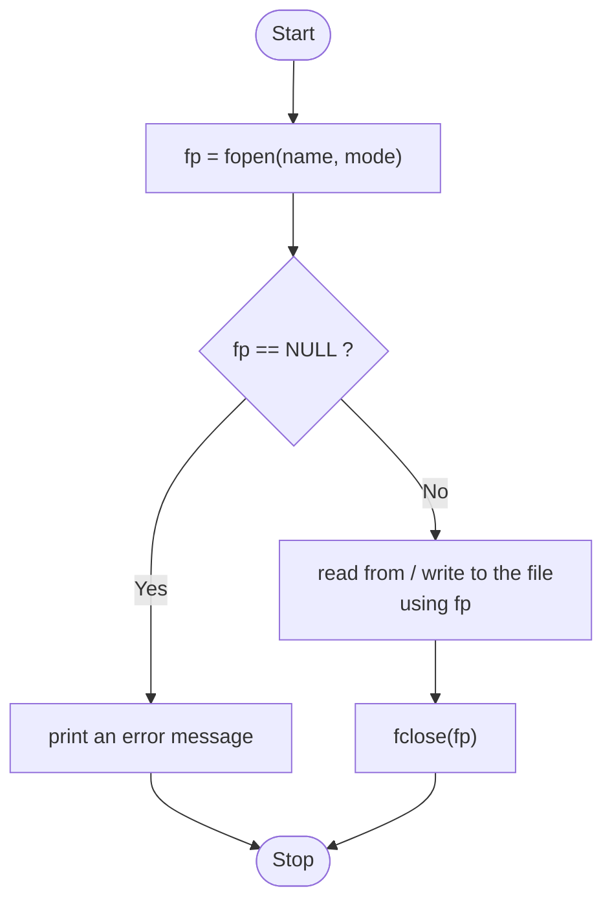
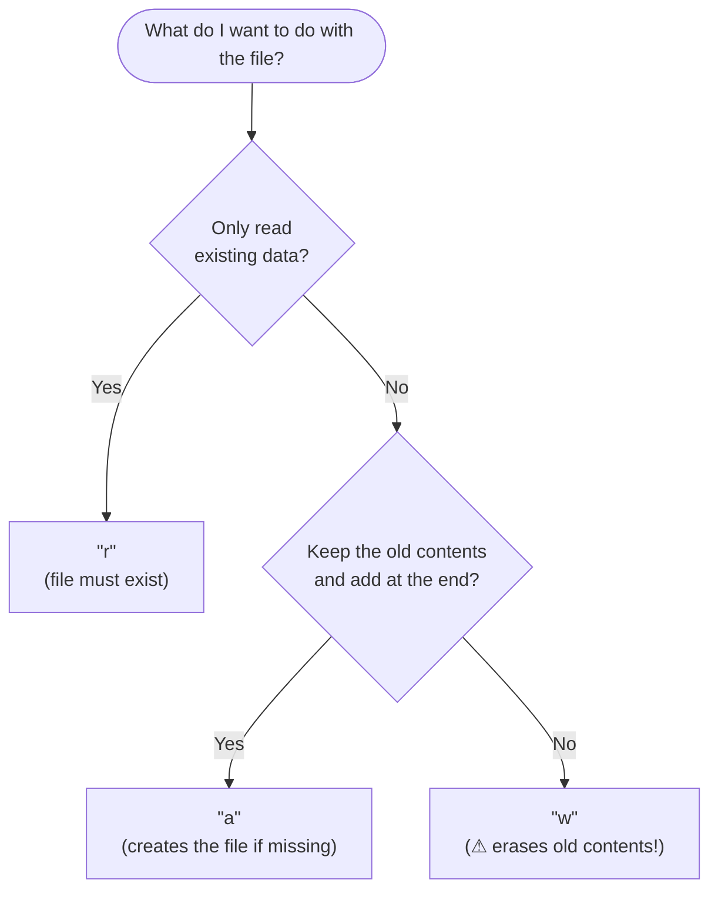
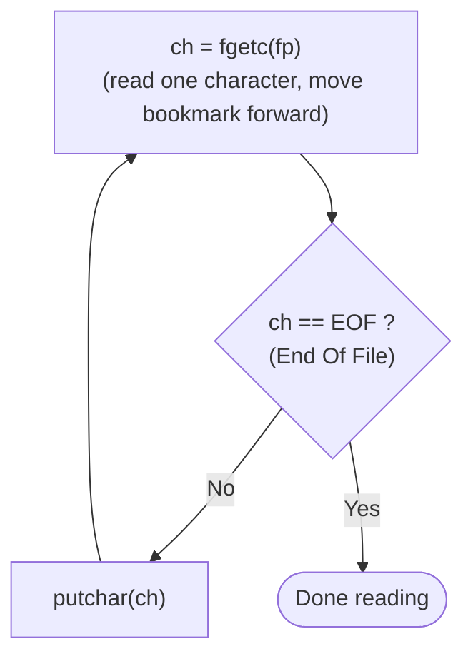
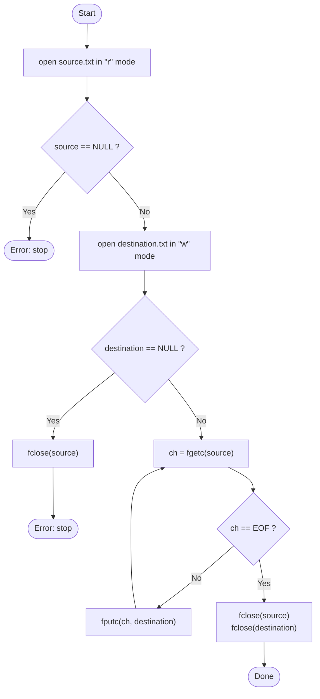

# Chapter 19 — Lecture: File Input/Output

## 📖 Reference: *Let Us C*, 19th Edition — Chapter 19: "File Input/Output"

---

## 19.1 File Operations — The Big Picture

Working with a file in C always follows the same three-step pattern:

1. **Open** the file — associate it with a `FILE *` pointer.
2. **Read from / write to** the file using that pointer.
3. **Close** the file to release resources and ensure all data is actually saved (flushed) to disk.



Think of `fp` as a **bookmark** into the file: every read or write happens at the bookmark's position and then moves it forward.

```
   Your program                         Disk
 ┌──────────────┐    FILE *fp     ┌──────────────┐
 │  fgetc, fgets│ ◄────────────── │   data.txt   │   reading
 │  fputc, fputs│ ──────────────► │              │   writing
 └──────────────┘                 └──────────────┘
```

### 19.1.1 Opening a File

```c
FILE *fp;
fp = fopen("data.txt", "r");   /* "r" = open for reading */

if (fp == NULL)
{
    printf("Error: could not open file.\n");
    return 1;
}
```

> **Always check the return value of `fopen()`!** It returns `NULL` if the file cannot be opened (e.g., it doesn't exist for `"r"` mode, or there's a permissions issue) — proceeding to use a `NULL` file pointer causes undefined behaviour (typically a crash).

### File Opening Modes

| Mode | Meaning |
|---|---|
| `"r"` | Read — file must already exist |
| `"w"` | Write — creates a new file, or **overwrites/truncates** an existing one |
| `"a"` | Append — writes are added to the end; creates the file if it doesn't exist |
| `"r+"` | Read and write — file must exist |
| `"w+"` | Read and write — creates new/overwrites existing |
| `"a+"` | Read and append |
| `"rb"`, `"wb"`, etc. | Same as above, but in **binary** mode (no text translation, e.g. of line endings) |

**Picking the right mode:**



### 19.1.2 Reading from a File

```c
char ch;
while ((ch = fgetc(fp)) != EOF)
    putchar(ch);
```



### 19.1.3 Closing the File

```c
fclose(fp);
```

> Forgetting to close a file can lead to **data loss** (buffered writes may never actually reach disk) and resource leaks, especially in long-running programs that open many files.

## 19.2 Counting Characters, Tabs, Spaces, etc.

```c
#include <stdio.h>

int main()
{
    FILE *fp;
    char ch;
    int chars = 0, spaces = 0, tabs = 0, newlines = 0;

    fp = fopen("sample.txt", "r");
    if (fp == NULL)
    {
        printf("Error opening file.\n");
        return 1;
    }

    while ((ch = fgetc(fp)) != EOF)
    {
        chars++;
        if (ch == ' ') spaces++;
        else if (ch == '\t') tabs++;
        else if (ch == '\n') newlines++;
    }

    fclose(fp);

    printf("Characters: %d, Spaces: %d, Tabs: %d, Newlines: %d\n", chars, spaces, tabs, newlines);
    return 0;
}
```

## 19.3 A File-Copy Program

```c
#include <stdio.h>

int main()
{
    FILE *source, *destination;
    char ch;

    source = fopen("source.txt", "r");
    if (source == NULL)
    {
        printf("Cannot open source file.\n");
        return 1;
    }

    destination = fopen("destination.txt", "w");
    if (destination == NULL)
    {
        printf("Cannot open destination file.\n");
        fclose(source);
        return 1;
    }

    while ((ch = fgetc(source)) != EOF)
        fputc(ch, destination);

    fclose(source);
    fclose(destination);

    printf("File copied successfully.\n");
    return 0;
}
```

**Flow of the copy program:**



```
 source.txt ──fgetc──►  ch  ──fputc──► destination.txt
              (one character at a time, until EOF)
```

## 19.4 String (Line) I/O in Files

```c
char line[100];

fgets(line, sizeof(line), fp);       /* read one line */
fputs("Hello, file!\n", fp);          /* write one line */
```

```c
#include <stdio.h>
int main()
{
    FILE *fp = fopen("notes.txt", "r");
    char line[200];

    if (fp == NULL) { printf("Error opening file.\n"); return 1; }

    while (fgets(line, sizeof(line), fp) != NULL)
        printf("%s", line);

    fclose(fp);
    return 0;
}
```

## 19.5 Text Files and Binary Files

| Text Mode | Binary Mode |
|---|---|
| Data stored as human-readable characters | Data stored as raw bytes matching in-memory representation |
| Platform-specific newline translation may occur (`\n` ↔ `\r\n` on Windows) | No translation — bytes are read/written exactly as-is |
| Suitable for `.txt`, `.csv`, source code | Suitable for images, executables, structured records (`fread`/`fwrite`) |

## 19.6 Record I/O in Files — `fread()` and `fwrite()`

For structured data (e.g., an array of `struct Student`), binary I/O lets you read/write entire structures directly, without manual formatting:

```c
struct Student
{
    char name[30];
    int rollNumber;
    float cgpa;
};

FILE *fp = fopen("students.dat", "wb");
struct Student s1 = {"Ayan", 101, 8.75};

fwrite(&s1, sizeof(struct Student), 1, fp);   /* write ONE struct's worth of raw bytes */
fclose(fp);
```

```c
FILE *fp = fopen("students.dat", "rb");
struct Student s2;

fread(&s2, sizeof(struct Student), 1, fp);    /* read ONE struct's worth of raw bytes */
printf("%s, %d, %.2f\n", s2.name, s2.rollNumber, s2.cgpa);
fclose(fp);
```

**`fwrite`/`fread` signature:** `size_t fwrite(const void *ptr, size_t size, size_t count, FILE *fp);` — writes `count` items, each `size` bytes, starting from `ptr`.

### 19.6.1 Modifying Records

To update a specific record within a binary file, use `fseek()` to move the file pointer to the exact byte offset of that record before reading/writing:

```c
FILE *fp = fopen("students.dat", "r+b");
struct Student updated = {"Ayan", 101, 9.10};

fseek(fp, 1 * sizeof(struct Student), SEEK_SET);   /* jump to the 2nd record (index 1) */
fwrite(&updated, sizeof(struct Student), 1, fp);    /* overwrite it */

fclose(fp);
```

**Picture of `students.dat`** — records sit one after another, each exactly `sizeof(struct Student)` bytes long:

```
 byte offset:  0                 1×size            2×size            3×size
               ┌─────────────────┬─────────────────┬─────────────────┐
               │   record 0      │   record 1      │   record 2      │
               └─────────────────┴─────────────────┴─────────────────┘
                                 ▲
       fseek(fp, 1 * sizeof(struct Student), SEEK_SET)
       moves the bookmark here, so fwrite overwrites record 1
```

`SEEK_SET` (from file start), `SEEK_CUR` (from current position), and `SEEK_END` (from file end) are the three standard reference points for `fseek()`.

## 19.7 Low-Level File I/O (Brief Overview)

*Let Us C* also introduces OS-level (POSIX) file I/O functions like `open()`, `read()`, `write()`, `close()`, which operate on integer **file descriptors** rather than `FILE *` pointers. These are lower-level, platform-specific (not part of standard C, but of the underlying OS API), and generally used only for specialized system-programming needs — everyday C programs should prefer the standard `<stdio.h>` functions covered above.

## 19.8 Worked Program: Student Record Database (Text-Based)

```c
#include <stdio.h>

int main()
{
    FILE *fp;
    char name[30];
    int roll;
    float cgpa;
    int choice;

    printf("1. Add Record  2. Display All Records\nChoice: ");
    scanf("%d", &choice);

    if (choice == 1)
    {
        fp = fopen("students.txt", "a");   /* append mode: adds without erasing existing data */
        if (fp == NULL) { printf("Error opening file.\n"); return 1; }

        printf("Enter name, roll number, CGPA: ");
        scanf("%s %d %f", name, &roll, &cgpa);

        fprintf(fp, "%s %d %.2f\n", name, roll, cgpa);
        fclose(fp);
        printf("Record added.\n");
    }
    else if (choice == 2)
    {
        fp = fopen("students.txt", "r");
        if (fp == NULL) { printf("No records found.\n"); return 1; }

        printf("\n--- All Records ---\n");
        while (fscanf(fp, "%s %d %f", name, &roll, &cgpa) != EOF)
            printf("%-15s %5d %6.2f\n", name, roll, cgpa);

        fclose(fp);
    }

    return 0;
}
```

## 19.9 Common Pitfalls

| Pitfall | Example | Fix |
|---|---|---|
| Not checking `fopen`'s return value | `fp = fopen(...); fgetc(fp);` | Always check `if (fp == NULL)` before using `fp` |
| Forgetting `fclose` | Program ends without closing files | Always `fclose()` every opened file, ideally as soon as done |
| Using `"w"` when you meant `"a"` | Data overwritten unintentionally | Use `"a"` (append) to preserve existing content |
| Mixing text and binary functions | Using `fprintf`/`fscanf` on a file meant for `fread`/`fwrite` structs | Match your read/write functions to how the file was actually written |
| Off-by-one in `fseek` record offset | `fseek(fp, n * sizeof(struct), ...)` with wrong `n` | Remember record indices are 0-based, matching array indexing |

## 19.10 Key Takeaways

1. File handling follows Open → Read/Write → Close; always check `fopen`'s return value for `NULL`.
2. Modes (`"r"`, `"w"`, `"a"`, and their `+`/`b` variants) determine read/write/append/binary behaviour — choosing the wrong one can silently destroy existing data (`"w"` truncates).
3. Character-based (`fgetc`/`fputc`), line-based (`fgets`/`fputs`), and formatted (`fprintf`/`fscanf`) functions all work for text files.
4. `fread`/`fwrite` handle raw binary data (e.g., whole structures) efficiently, without manual text formatting.
5. `fseek()` repositions the file pointer to a specific byte offset, enabling direct access to (and modification of) a specific record in a binary file.
